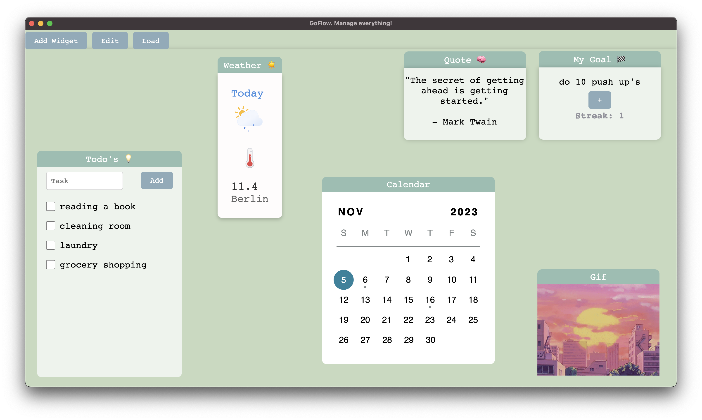

# GoFlow
GoFlow. An App to manage everything! :)
## Description

With GoFlow you can create beautiful designs, with an awesome selection of widgets!

## Preview

## Getting Started

To use GoFlow, follow these steps:

1. Navigate to the 'Goflow' directory.
2. Inside 'Goflow', find the 'src' directory.
3. Use the following command to install the necessary dependencies:

## You can copy following
```bash
cd src
npm install
npm start
```

## If you want to build the app just do following
```bash
cd src
npm install
npm run make
``````

Feel free to modify it to match your specific app's details.


